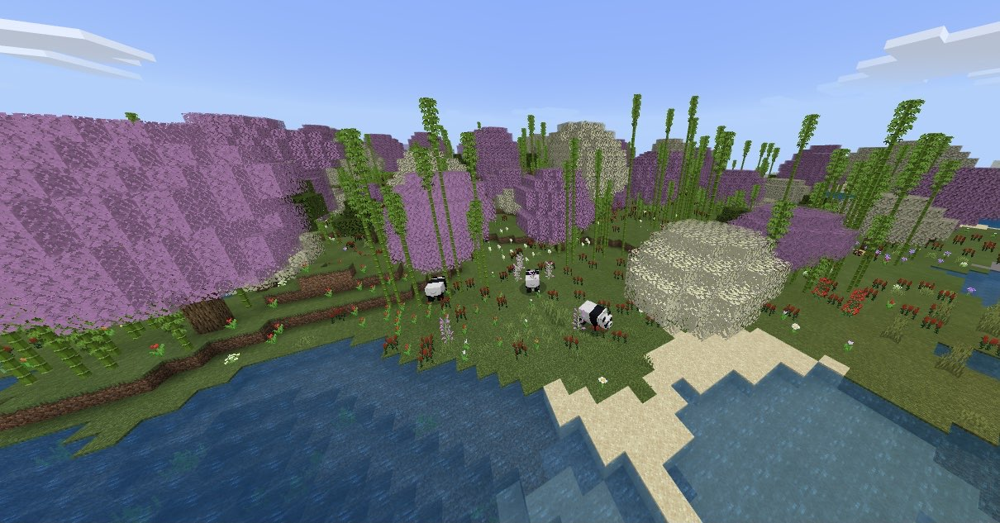
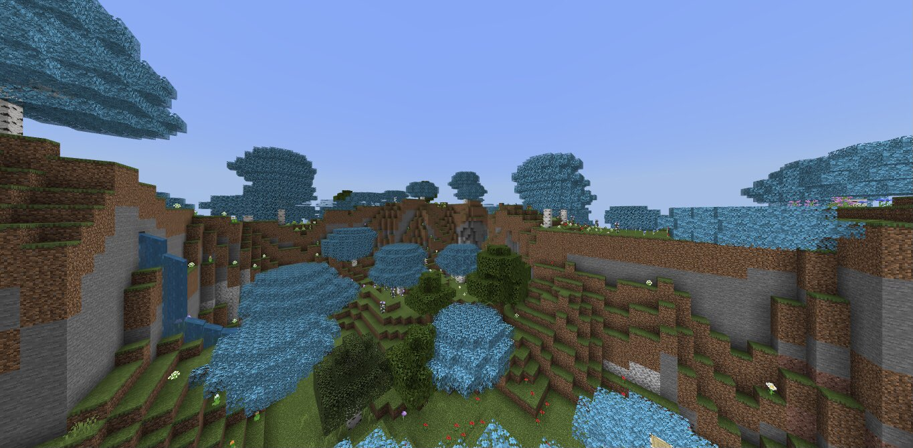

# Biomes

## Cherry Blossoms

The Cherry Blossom biome is a sanctuary where pandas and players can live in peace. It's beautiful pink and white cherry blossom trees provide cherries to the humans to eat and bamboo grows there for the pandas to munch on.

## Wisteria Forests

Wisteria Forests are a stunning biome with blissful blue trees. They spawn higher up to provide beautiful hills as shown above!

