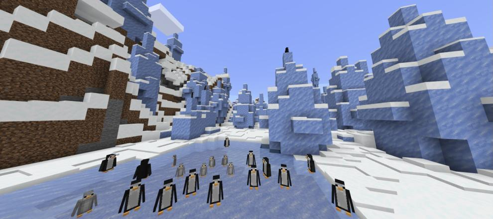

# Entities

## Penguins

Penguins are a cute mob in biodiversity that spawn in icy biomes and spend their time swimming and hunting fish. When killed they drop feathers but you are better off keeping them as pets

