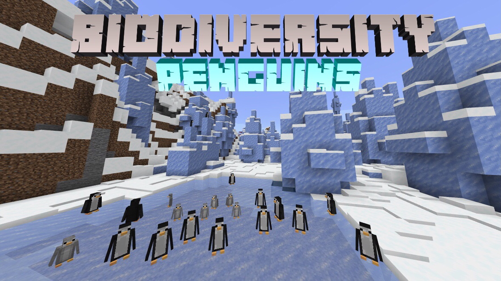

# Getting Started

Biodiversity is an exploration addon that enhances the beauty of the minecraft landscape by adding magnificent biomes and cute animals to the game. It is the first of many to come in the Frederox library of addons.

## Download

Biodiversity can be downloaded on the [github release page!](https://github.com/FrederoxGit/Biodiversity/releases/) After you have downloaded Biodiversity please make sure to follow the setup guide.

## Setup Guide

To get started activate the pack onto your world and go to the experimental toggles and activate:

> 1. Holiday Creator Features
> 2. Creation of Custom Biomes
