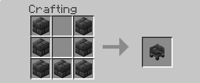
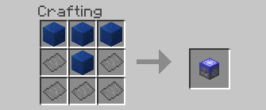

# Block Recipes

## Deepslate Basin

Deepslate Basins are used to forge metal items. To craft one you will need 7 deepslate bricks.

## Rocket Table

Rocket tables are used to craft pieces for rockets, along with rocket upgrades. To craft one you will need 5 Metal Sheets & 4 blocks of lapis

