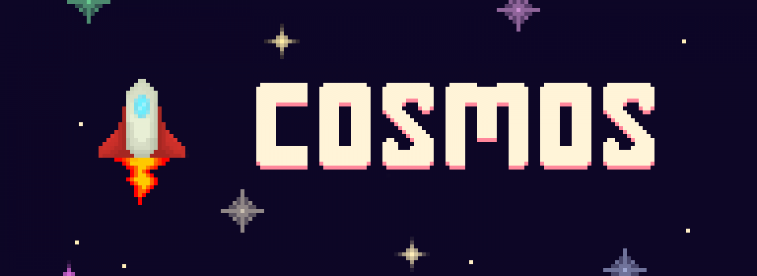

# Getting Started

Cosmos is an open world space addon, you can explore distant planets such as the Moon and Mars.

## Download

Cosmos can be downloaded on the [github release page!](https://github.com/FrederoxGit/Cosmos/releases/) After you have downloaded Cosmos please make sure to follow the setup guide.

## Setup Guide

To get started activate the pack onto your world and go to the experimental toggles and activate:

> 1. Holiday Creator Features
> 2. Creation of Custom Biomes
> 3. Additional Modding Capabilities

Now load up your world, and run two commands

> 1. /function start
> 2. /function finish
