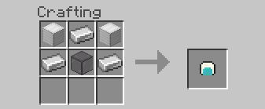
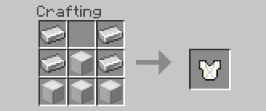
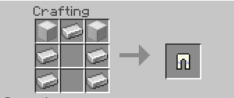
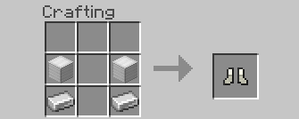
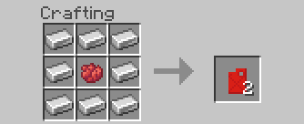

# Item Recipes

## Metal Sheet

To forge a metal sheet you will need: A Deepslate Basin, a flint & Steel, and an Iron Ingot.

> 1. Place down your Deepslate Basin
> 2. Place an Iron Ingot in the Basin
> 3. Ignite the Basin with a flint of steel
> 4. Wait for 5-30 seconds, and pickup your metal sheet

## Space Helmet

## Space Chestplate

## Space Leggings

## Space Boots

## Diamond Drill

The Diamond drill is an essential tool for going to space. It is required to mine blocks in space.

## Empty Fuel Tank

The Empty fuel tank is an ingredient for fuel

## Fuel Tank

The Fuel tank is used for filling up your rocket. To get it follow these steps

> 1. Get your Empty Fuel Tank
> 2. Find oil underground
> 3. Use the Empty Fuel tank on the oil to collect it
