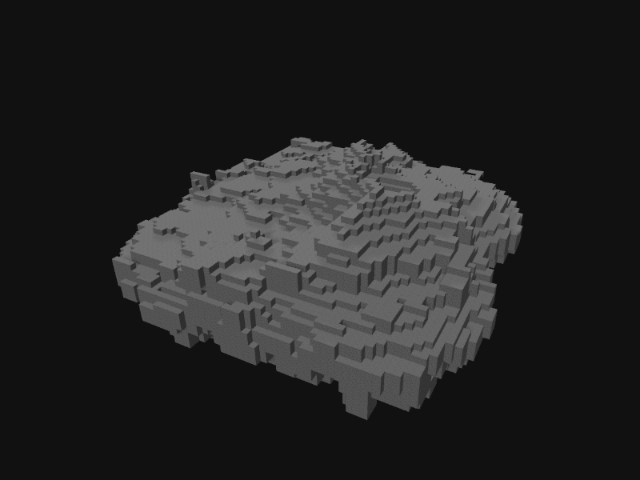
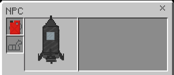

# Going to the Moon

## Required Items

For this guide, you will need to have:

> - A rocket
> - Two Fuel Tanks
> - A Space Suit
> - A Diamond Drill

## Rocket Setup

Place down your rocket, next get into the rocket and open its inventory. You should insert the fuel tank into the first slot of the rockets inventory. Next close the inventory and select the button to button to launch to the moon!

